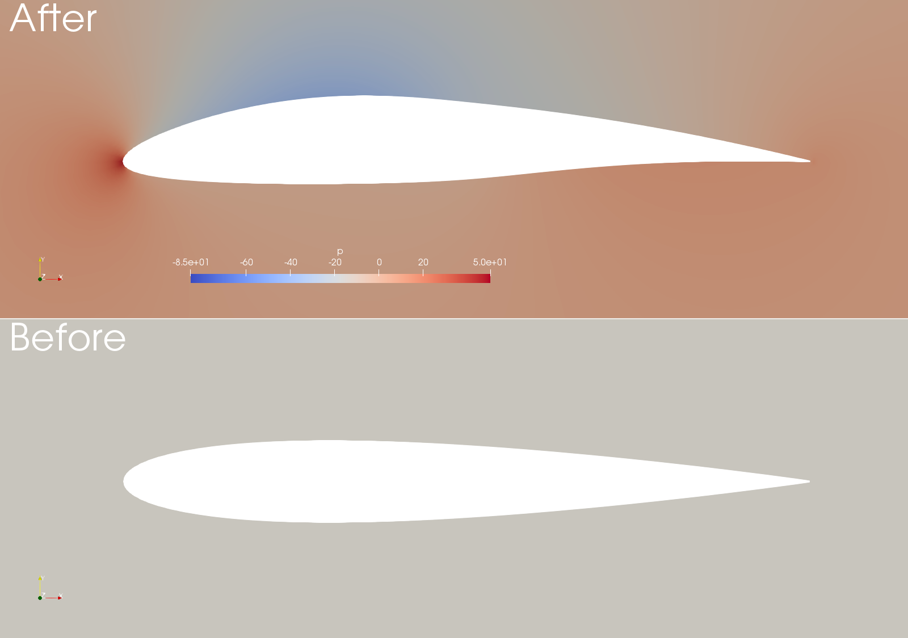

## TODO Using span-wise averaged function to generate runtime data

The goal is to figure out how to [use the source code](https://github.com/ZmengXu/sampledPlaneAverage/tree/of7/sampledSurface/sampledPlaneSpanwise) and porting data
from v7 to v1906.

The testing code would be in the branch: `span-wise-average`.
